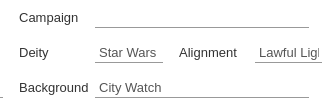
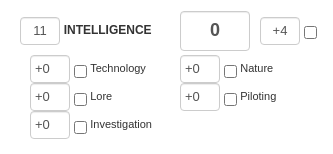
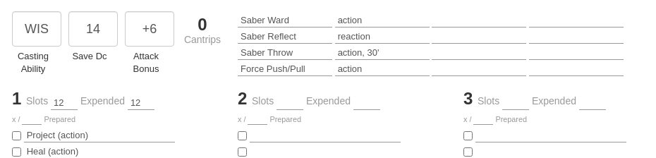
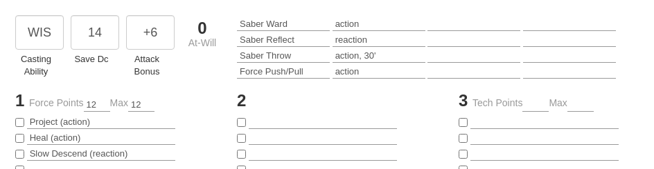

# MythWeaversStarWars5e
This script requires the TamperMonkey extention for your browser.
It is meant to be used with Myth-Weavers.com 's Dungeons & Dragons 5th Edition character sheets, to be used with the Star Wars 5e conversion. This script only modifies the display of the character
sheet in your browser - nothing changes on Myth-Weavers' database. Therefore, a computer/browser without this script would still see the unmodified character sheet.

- Install [TamperMonkey](https://www.tampermonkey.net/index.php?locale=en) for your browser
- Install this script by [clicking here](https://github.com/BlackPhoenix/MythWeaversStarWars5e/raw/refs/heads/main/Myth-Weavers%20DND%205e%20to%20Star%20Wars%205e.user.js)

Once installed, set the "Deity" on your character sheet to "Star Wars":

Save your character sheet, then reload your page.

Before | After
--- | ---
 | 

Before:

After:

